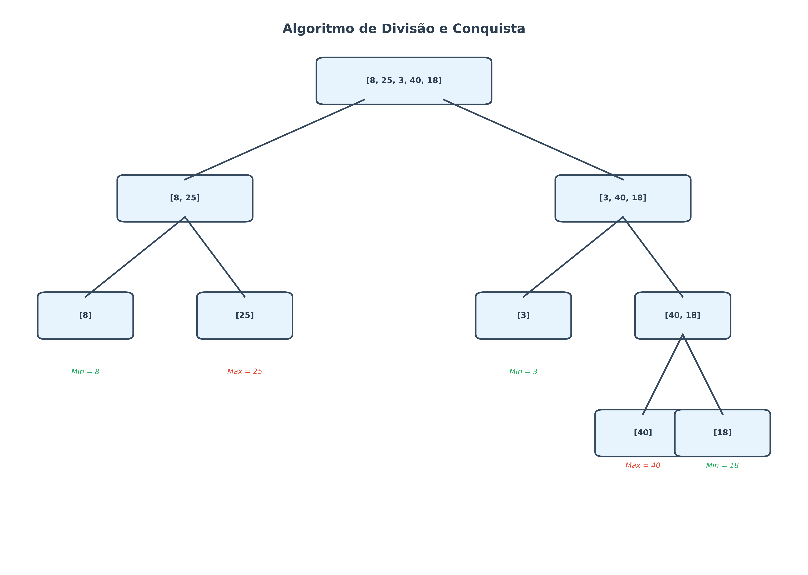

# 🔎 Algoritmo MaxMin Select

## 📌 Descrição do Projeto
Este projeto implementa o **algoritmo MaxMin Select**, uma técnica baseada em **divisão e conquista** para encontrar **simultaneamente o menor e o maior elemento** em uma lista.

Diferente da abordagem tradicional (que faria 2 comparações por elemento), este método reduz o número de comparações, aumentando a **eficiência** do processamento.

---

## 🚀 Como Executar o Projeto

### ✅ Pré-requisitos
- Ter **Python 3.x** instalado em sua máquina.

### ▶️ Passos para execução
 Clone o repositório:
   ```bash
   git clone https://github.com/AnaFlaviaRibeiro/FPAA-2.2025.git
   ```
```bash
   cd ProjetoMaxminSelect
   python MaxMin.py
```
---

## ⚙️ Funcionamento do Algoritmo

O **MaxMin Select** utiliza a estratégia de **Divisão e Conquista**:

1. **Divisão**
   O array é recursivamente dividido em duas partes menores.

2. **Casos Base**
   - 1 elemento → retorna o mesmo valor como mínimo e máximo.
   - 2 elementos → realiza **1 comparação** para definir quem é o menor e quem é o maior.

3. **Combinação**
   Os resultados das metades são unidos, escolhendo o menor dos mínimos e o maior dos máximos.

---

## 📖 Exemplo

Para a lista:
```text
[8, 25, 3, 40, 18]
```

- Divide em `[8, 25]` e `[3, 40, 18]`.
- Avalia cada parte:
  - `[8, 25]` → min = 8, max = 25
  - `[3, 40, 18]` → min = 3, max = 40
- Combina os resultados:
  - min = **3**, max = **40**

---

## 📊 Análise da Complexidade

### 🔢 Comparações
- Caso base com 2 elementos → **1 comparação**.
- Combinação de duas metades → **2 comparações**.

Recorrência:
\[
C(n) = 2C(n/2) + 2
\]

Solução:
\[
C(n) = \frac{3n}{2} - 2 \quad \approx O(n)
\]

### 📚 Teorema Mestre
\[
T(n) = 2T(n/2) + O(1)
\]

- **a = 2**, **b = 2**, **f(n) = O(1)**
- \(\log_b a = \log_2 2 = 1\)
- Como \( f(n) = O(1) \subset O(n^{1 - \epsilon}) \), aplica-se o **Caso 1**.

Portanto:
\[
T(n) = O(n)
\]

---

## Diagrama
A imagem abaixo ilustra o processo de divisão e conquista no algoritmo MaxMin Select, mostrando como o problema é decomposto em subproblemas e como os resultados parciais são combinados:

